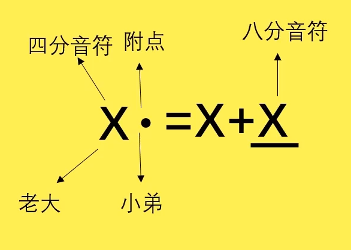

# 乐理篇

---

### 什么是音

音是由**物体振动而产生**

* **规则震动** => 乐音 （乐音乐器：钢琴 吉他 小提琴）
* **不规则震动** => 噪音 （噪音乐器：锣鼓沙锤）

音乐上的音属于**乐音**：

* **唱名**： do re mi fa so la xi （排列不变）

* **简谱**：1 2 3 4 5 6 7（排列不变）

* **音名**：C D E F G A B (C 大调则C放首位，根据调性排列顺序可变）

  音名相对，唱名绝对

### 节拍的认识

常用节拍

* 2/4 拍 => 强 弱
* 4/4 拍 => 强 弱 强 弱
* 三拍子
  * 3/4 拍 => 强 弱 弱
  * 6/8 拍 => 强 弱 弱 次强 弱 弱

### 音符时值

时值 => 音符的长短/  音符持续时间

### 单拍子和复拍子

* **单拍子** => 每个小节只有一个强拍
  * 2/4拍 => 强 弱
  * 3/4拍 => 强 弱 弱
* **复拍子** => 每个小节有多个强拍
  * 4/4拍 => 强 弱 次强 弱
  * 6/8拍 => 强 弱 弱 次强 弱 弱

### 附点音符

**附点音符时值是前一个音符一半的时值**

例如：附点四分音符 = 四分音符 + 四分音符的一半(八分音符)

### 切分音与休止符

**切分音**：

* 两个8分音符，在**中间加入4分音符**切开两个连着的8分音符，这就叫切分音
* **切分音的时值是相邻两个音符的总和**
* 切分音打破常规的节奏形态，让强音变弱音，让弱音变强音

**休止符**

### 三连音

将一个整体分成三等分

### 音程

**音程**：两个音符之间的距离，单位是度

**音程属性**：两个音符之间有几个白键就是几度（钢琴）